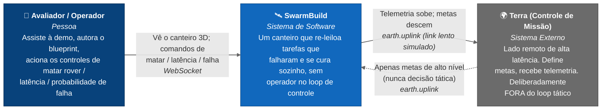
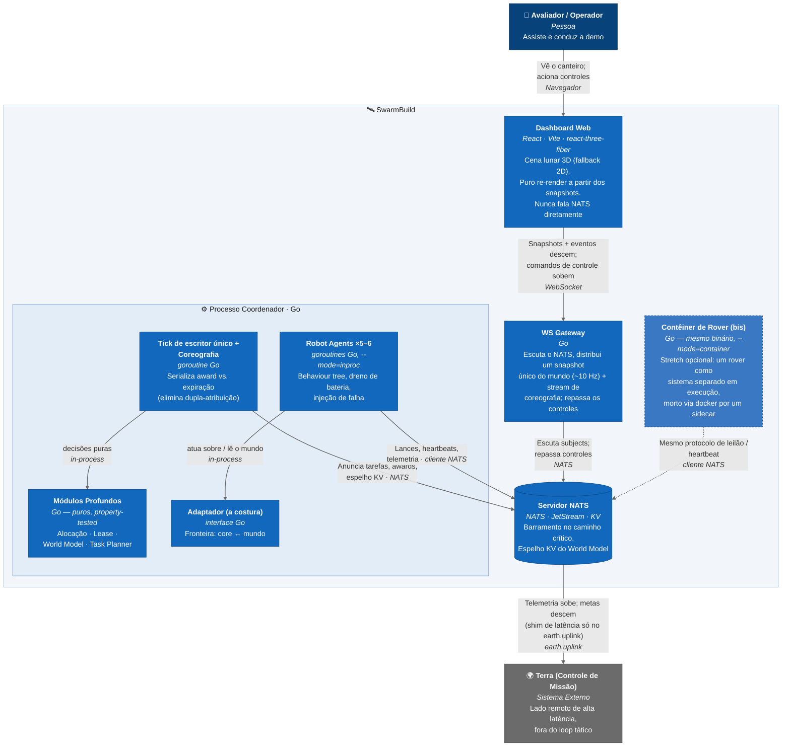
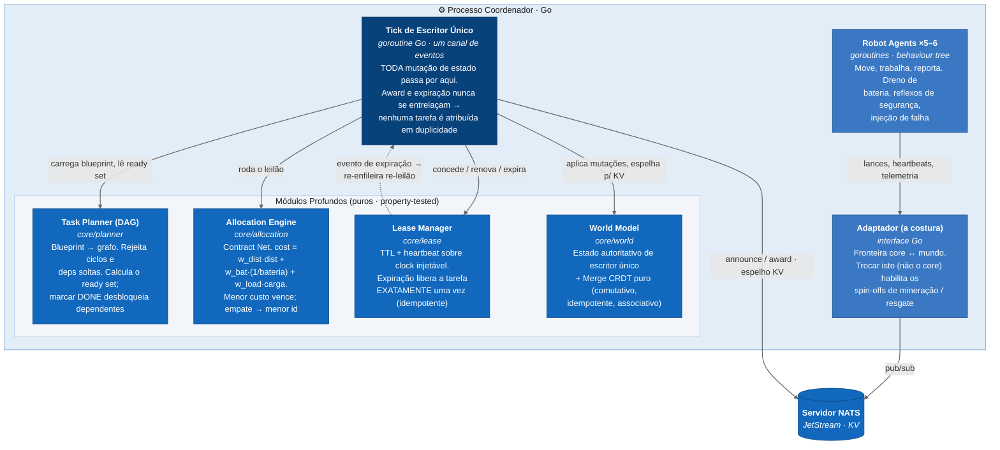

# SwarmBuild — Diagramas C4 (PT-BR)

> Derivado de [TECHSPEC.md](./TECHSPEC.md), da linguagem de domínio em [CONTEXT.md](../CONTEXT.md) e das decisões em [docs/adr/](./adr/).
> Renderizado com o suporte a C4 do Mermaid. Níveis: **Contexto** (o sistema no seu ambiente) e **Contêiner** (unidades de runtime dentro do sistema).
>
> Este C4 descreve a **arquitetura definida como um todo** — a ideia completa, não apenas o que já está codado. O que já está implementado vs. o que é *next step* está marcado na legenda de status ao final.

---

## Nível 1 — Contexto do Sistema

Como o SwarmBuild se posiciona entre as pessoas que assistem à demo e o link de alta latência com a Terra. A tese central: a **autocura tática acontece no canteiro de obras**, nunca esperando a Terra responder.

**Leitura:** o operador nunca comanda rovers individualmente — ele autora um **blueprint** (o que construir) e aciona controles de demonstração. A Terra está fora do loop tático **de propósito**: o atraso ida-e-volta Terra–Lua (~2,6 s, mais com relay) torna impossível reagir a uma falha a tempo. Toda decisão tática (leilão, lease, re-leilão) vive na borda.

---

## Nível 2 — Contêiner

As unidades de runtime. O **processo Coordenador** (Go) abriga os quatro módulos profundos puros, o *tick* de escritor único, a coreografia e os rovers in-process. O **WS Gateway** é a única coisa com que o navegador conversa. O **NATS** está no caminho crítico ([ADR-0002](./adr/0002-nats-on-the-critical-path.md)); o **contêiner de rover** opcional é o bis ([ADR-0001](./adr/0001-in-process-rovers-with-container-encore.md)).

---

## Nível 3 — Componentes (Processo Coordenador)

Zoom no Coordenador: como os quatro **módulos profundos** puros se conectam ao mundo vivo através de um único escritor. Esta é a substância de engenharia do produto ([ADR-0003](./adr/0003-single-writer-live-path-crdt-as-tested-module.md)).

**Por que escritor único + CRDT testado ([ADR-0003](./adr/0003-single-writer-live-path-crdt-as-tested-module.md)):** a autocura principal (expiração de lease + re-leilão) não precisa de merge — com um único escritor não há reivindicações concorrentes para reconciliar. O CRDT é construído e provado por *property tests* (histórias 18–22 do PRD) como módulo profundo; a tolerância a partição é demonstrada com os testes verdes de convergência, não improvisada ao vivo no palco.

---

## Relacionamentos-chave (subjects do barramento)

| Subject | Direção | Propósito |
|---|---|---|
| `task.announce` | Coordenador → barramento | Tarefa anunciada para leilão |
| `task.bid.<task_id>` | Rover → barramento | Rover submete seu custo (lance) |
| `task.award` | Coordenador → barramento | Vencedor recebe um lease |
| `robot.heartbeat.<id>` | Rover → barramento | Renovação de lease (nunca sofre shim de latência) |
| `robot.telemetry.<id>` | Rover → barramento | Posição, bateria, saúde, progresso |
| `control.command` | Navegador → Gateway → barramento | `kill` / `setLatency` / `setFailureProb` |
| `earth.uplink` | ↔ Terra | O **único** lugar onde vive o shim de latência |

---

## Status de implementação (o que está pronto vs. next steps)

Sequência robustez-primeiro, com cauda cortável (TECHSPEC §6). O C4 acima é a arquitetura-alvo completa; abaixo, o que cada parte já entrega hoje.

| # | Etapa | No C4 | Status |
|---|---|---|---|
| 1 | **Core profundo + testes** — Alocação, Lease, World Model, Task Planner | `Módulos Profundos` (Nível 3) | ✅ Pronto |
| 2 | **Sim + Coordenador** — rovers goroutine, behaviour tree, tick de escritor único | `Coordenador`, `Robot Agents`, `Adaptador` | ✅ Pronto |
| 3 | **NATS no caminho** — leilão/telemetria/uplink; espelho KV; bootstrap endurecido | `Servidor NATS`, subjects | ✅ Pronto |
| 4 | **WS Gateway + canvas 2D** — fluxo matar→curar→concluir visível | `WS Gateway`, `Dashboard Web` (2D) | ✅ Pronto |
| 5 | **Coreografia** — ritmar os beats a partir de eventos reais | `Coreografia` (Nível 2) | ⬜ Next step |
| 6 | **3D react-three-fiber** — trocar o renderer; 2D segue como fallback ([ADR-0004](./adr/0004-react-three-fiber-3d-built-2d-first.md)) | `Dashboard Web` (3D) | ⬜ Next step |
| 7 | **Stretch** — bis em contêiner; toggle de partição CRDT ao vivo | `Contêiner de Rover (bis)` | ⬜ Stretch |

> **Legenda:** ✅ implementado e testado · ⬜ definido na arquitetura, planejado para as próximas iterações. O caminho 2D já é a versão ensaiada de *fallback* do 3D; o contêiner de rover usa o **mesmo binário e o mesmo protocolo NATS** dos rovers in-process — o bis muda o *hosting*, não o protocolo.

---

## Notas para o leitor

- **Os módulos profundos são o produto.** Todo o resto (sim, barramento, gateway, web) existe para tornar esses quatro módulos puros *visíveis*.
- **O barramento está no caminho crítico** por decisão de projeto ([ADR-0002](./adr/0002-nats-on-the-critical-path.md)) — rovers in-process e em contêiner são ambos clientes NATS, então o bis muda o hosting, não o protocolo.
- **O navegador é um cliente puro** — snapshots de estado completo o tornam seguro a reconexão, sem deriva de simulação no lado do cliente.
- **Autocura = expiração + re-leilão**, composta sem nenhuma lógica de supervisão e sem a Terra no loop. Esse é o pitch inteiro.
- **Portabilidade pelo Adaptador** — trocar a costura (não o core) é o que habilita os spin-offs de mineração e resgate: o core (estado global + leilão + autocura) é idêntico; Lua, mina e escombros são apenas perfis de capacidade diferentes.
</content>
</invoke>
