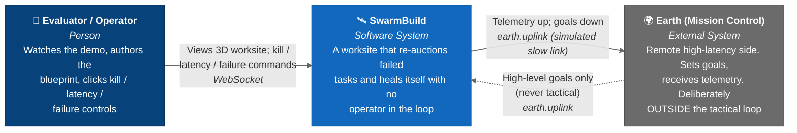
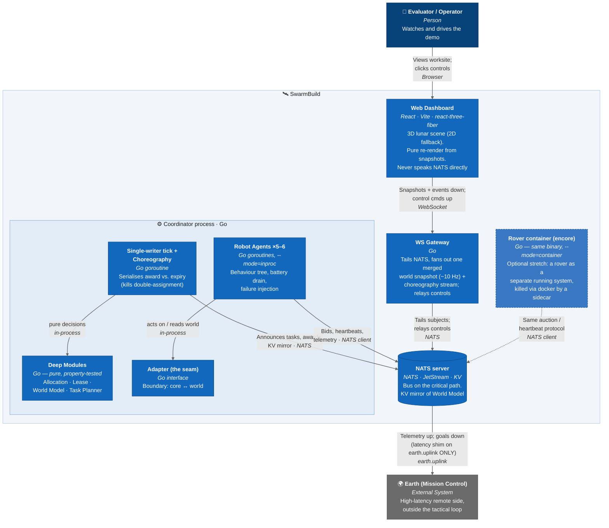

# SwarmBuild — C4 Diagrams

> Derived from [TECHSPEC.md](./TECHSPEC.md) and the domain language in [CONTEXT.md](../CONTEXT.md).
> Rendered with Mermaid's C4 support. Levels: **Context** (System in its environment) and **Container** (runtime units inside the system).

---

## Level 1 — System Context

How SwarmBuild sits between the people watching the demo and the high-latency Earth link. The whole point: tactical self-heal happens **at the worksite**, never waiting on Earth.

---

## Level 2 — Container

The runtime units. The **Coordinator process** (Go) holds the four pure deep modules plus the single-writer tick, choreography and in-proc rovers. The **WS Gateway** is the only thing the browser talks to. **NATS** is on the critical path ([ADR-0002](./adr/0002-nats-on-the-critical-path.md)); the optional **rover container** is the encore ([ADR-0001](./adr/0001-in-process-rovers-with-container-encore.md)).

---

## Key relationships (subjects on the bus)

| Subject | Direction | Purpose |
|---|---|---|
| `task.announce` | Coordinator → bus | Task announced for auction |
| `task.bid.<task_id>` | Rover → bus | Rover submits its cost |
| `task.award` | Coordinator → bus | Winner granted a lease |
| `robot.heartbeat.<id>` | Rover → bus | Lease renewal (never latency-shimmed) |
| `robot.telemetry.<id>` | Rover → bus | Position, battery, health, progress |
| `earth.uplink` | ↔ Earth | The **only** place the latency shim lives |

## Notes for readers

- **Deep modules are the product.** Everything else (sim, bus, gateway, web) exists to make those four pure modules *visible*.
- **The bus is on the critical path** by design ([ADR-0002](./adr/0002-nats-on-the-critical-path.md)) — both in-proc and container rovers are NATS clients, so the encore changes hosting, not the protocol.
- **The browser is a pure client** — full snapshots make it reconnect-safe with no client-side simulation drift.
- **Self-heal = expiry + re-auction**, composed with no supervisory logic and no Earth in the loop.
